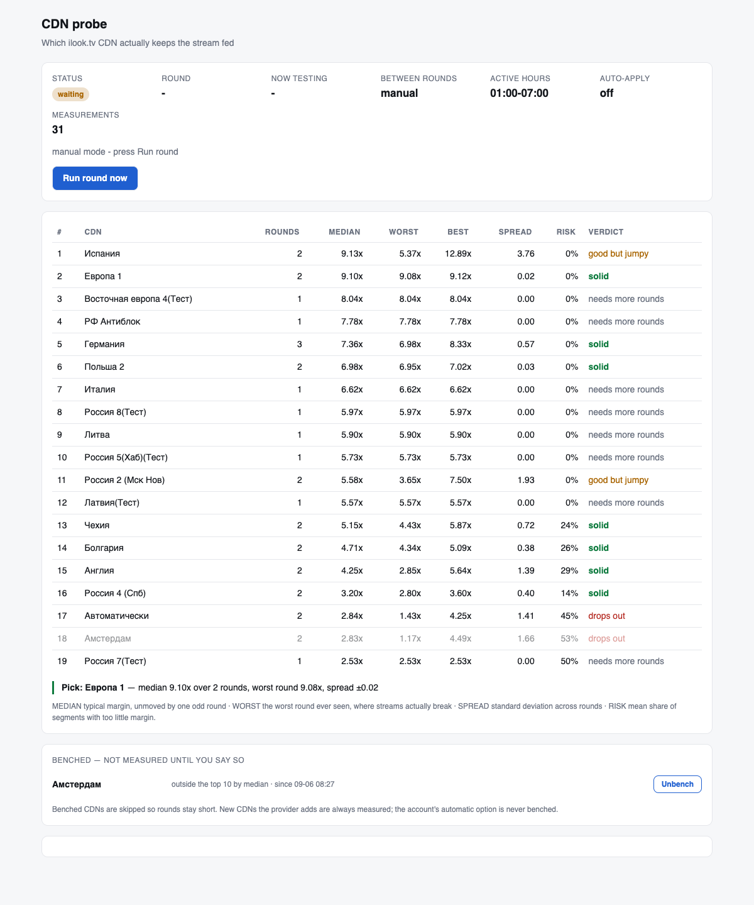
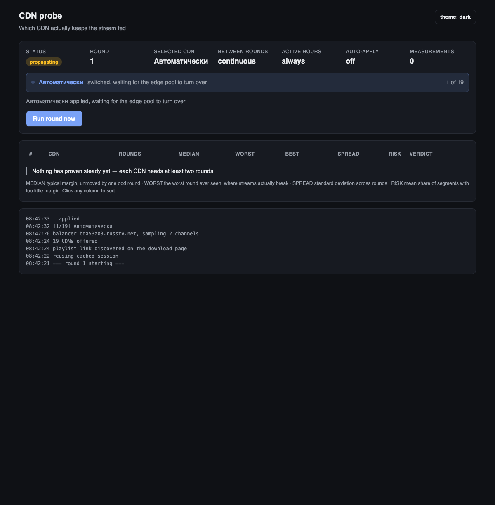

# cdnprobe

Определяет, **какой CDN у ilook.tv действительно тянет поток** — перебирает все
CDN, доступные аккаунту, замеряет их снова и снова и ранжирует по фактам, а не
по одному удачному замеру.

Один Docker-контейнер с дашбордом.

[English](README.md) · Русский

Одну и ту же панель OTTClub используют несколько витрин — **ilook.tv** и
**vipdrive.net** в их числе, — поэтому адрес указывается в `PANEL_URL`.



<details><summary>Тёмная тема</summary>



</details>

---

## ⚠️ Не направляй это на аккаунт, с которого смотришь — без часов сна

Контейнер **постоянно переключает CDN**, в этом весь смысл. Пока идёт круг,
смотреть на этом аккаунте невозможно: поток перебрасывается каждые несколько
минут, и каждое переключение минутами устаканивается.

Два способа с этим жить:

**Отдельная дешёвая подписка.** Пара долларов — и круги идут круглосуточно, ни
разу не задев то, что ты смотришь. Это чистый вариант.

**Или `ACTIVE_HOURS` вместе с `AUTO_APPLY`.** Мерить только пока спишь, а к
утру аккаунт остаётся на лучшем CDN. См. раздел
[Замеры на рабочем аккаунте](#замеры-на-рабочем-аккаунте).

В любом случае: ссылку на плейлист контейнер берёт из того аккаунта, в который
вошёл, — значит нагружается именно он.

---

## Установка

Образ публикуется в реестре GitHub, поэтому **клонировать необязательно** —
репозиторий нужен только чтобы собрать образ самому или менять код.

### Без клонирования: одна команда

```bash
docker run -d --name cdnprobe --restart unless-stopped \
  -p 8080:8080 \
  -e ILOOK_EMAIL='you@example.com' \
  -e ILOOK_PASSWORD='твой-пароль' \
  -e ROUND_PAUSE=none \
  -v cdnprobe-data:/data \
  ghcr.io/klimofey/ottclub-cdn-probe:latest
```

Дальше открыть <http://localhost:8080>. Любая настройка из таблицы ниже
добавляется таким же флагом `-e`. Например, мерить только ночью и оставлять
лучший CDN:

```bash
  -e ACTIVE_HOURS=01:00-07:00 -e TZ=Asia/Jerusalem -e AUTO_APPLY=true \
```

### Без клонирования: Docker Compose

Сохранить это как `docker-compose.yml` и выполнить `docker compose up -d`:

```yaml
services:
  cdnprobe:
    image: ghcr.io/klimofey/ottclub-cdn-probe:latest
    container_name: cdnprobe
    restart: unless-stopped
    ports:
      - "8080:8080"
    environment:
      ILOOK_EMAIL: you@example.com
      ILOOK_PASSWORD: your-password
      ROUND_PAUSE: none          # none | manual | 30m | 1h
      # PANEL_URL: https://ilook.tv
      # ACTIVE_HOURS: "01:00-07:00"   # only measure while you sleep
      # TZ: Europe/Berlin             # timezone the window is read in
      # AUTO_APPLY: "true"            # leave the best CDN applied
    volumes:
      - cdnprobe-data:/data

volumes:
  cdnprobe-data:
```

### Из исходников

```bash
git clone https://github.com/klimofey/ottclub-cdn-probe
cd ottclub-cdn-probe
cp .env.example .env
docker compose up -d --build   # --build собирает локально
```

### Повседневное

```bash
docker compose logs -f        # или: docker logs -f cdnprobe
docker compose pull && docker compose up -d    # обновиться до свежего образа
docker compose restart        # применить изменения в .env
docker compose down           # остановить, замеры сохранятся
docker compose down -v        # остановить и стереть историю
```

В томе лежат история замеров и кэш сессии браузера — его надо сохранять при
обновлениях, ради многодневной статистики всё и затевалось.

### Разовые команды

Пригодятся без запуска демона:

```bash
docker compose run --rm cdnprobe list    # плейлист и список CDN аккаунта
docker compose run --rm cdnprobe once    # один круг и выход
docker compose run --rm cdnprobe stats   # печать таблицы
```

## Настройки

Всё через переменные окружения; обязательны только две первые.

| Переменная | По умолчанию | Что делает |
|---|---|---|
| `ILOOK_EMAIL` | — | Почта аккаунта |
| `ILOOK_PASSWORD` | — | Пароль |
| `PANEL_URL` | `https://ilook.tv` | Панель, в которую входить |
| `ROUND_PAUSE` | `none` | Пауза между кругами: `none`, `manual`, `30m`, `1h`, `3600` |
| `ACTIVE_HOURS` | _(круглосуточно)_ | Мерить только в это окно, например `01:00-07:00` |
| `TZ` | `UTC` | Часовой пояс, в котором читается окно |
| `AUTO_APPLY` | `false` | Ставить лучший проверенный CDN в конце круга |
| `MAX_ACTIVE_CDNS` | `10` | Держать в ротации не больше стольких; `0` — без ограничения |
| `BENCH_MIN_ROUNDS` | `3` | Сколько кругов нужно, прежде чем банить |
| `BENCH_BELOW_RATIO` | `2.0` | Медиана ниже — бан сразу |
| `PAROLE_PER_ROUND` | `1` | Сколько забаненных перепроверять за круг; `0` — не перепроверять |
| `HISTORY_DAYS` | `30` | Замеры старше — удаляются |
| `WEB_PORT` | `8080` | Порт дашборда |

## Что именно меряется и почему не пинг

Задержка до эджей практически одинакова (150–230 мс) и не различает их вообще.
Разница целиком в пропускной способности, поэтому метрика — **realtime ratio**:
сколько секунд видео приезжает за секунду реального времени.

```
ratio = длительность сегмента / (размер / скорость)
```

`5x` — десять секунд видео качаются за две, запас четырёхкратный. `1x` — поток
едва успевает. Ниже `2x` любой сетевой чих даёт буферизацию.

Два решения делают цифры честными.

**Среднее взвешено по частоте выдачи эджа.** На одном CDN быстрые эджи (до
6.89x) выдавались в 10% случаев, а медленные (1.14x) — в 90%. Простое среднее
по серверам дало бы 3.7x; взвешенное по тому, что реально получает зритель, —
1.81x.

**Главная величина — медиана по кругам, а не среднее.** Одиночный выброс двигает
среднее и не двигает медиану, а выбросы случаются — см. ниже.

В таблице также **худший круг за всё время** и **разброс**: поток рвётся в
провалах, а не в среднем. CDN с медианой 9x и худшим кругом 1.5x хуже ровного
на 6x.

## Сколько идёт круг

Замерено на живом аккаунте: **1.6–2.5 часа** на все 19 CDN, или около **50
минут**, когда бан ужмёт ротацию до десяти.

Упор не в замер — он занимает ~2 минуты на CDN. Упор в провайдера: он принимает
смену CDN примерно **раз в пять минут**, и замер целиком помещается внутрь
этого ожидания. Разброс — из-за того, как быстро сменится пул эджей после
переключения: иногда 20 секунд, иногда полный таймаут.

Окно в шесть часов вмещает два-три круга за ночь — этого хватает, чтобы за
неделю набрать по 15–20 кругов на каждый CDN.

## Замеры на рабочем аккаунте

Две настройки вместе делают это терпимым без второй подписки:

```env
ACTIVE_HOURS=01:00-07:00
TZ=Asia/Jerusalem
AUTO_APPLY=true
```

Круги идут, только пока ты спишь, а по завершении аккаунт остаётся на CDN,
который себя доказал. Окно проверяется **перед каждым CDN**, а не раз в круг:
круг, не успевший закончиться к 07:00, приостановится и продолжится следующей
ночью, а не станет переключать CDN у тебя за завтраком.

`AUTO_APPLY` срабатывает только на вердикт **solid** — высокая медиана при
большом разбросе не годится. Если ничего устойчивого пока нет, настройка не
трогается, и это пишется в лог.

## Бан безнадёжных

Круг стоит около пяти минут на CDN, поэтому двадцать штук — это часы. Когда CDN
провалился несколько раз подряд, платить эту цену снова смысла мало: бан
позволяет остальным замеряться вдвое чаще, а именно это и уточняет статистику.

Три правила не дают этому стать самоподтверждающимся.

**До бана нужно несколько кругов.** Один плохой вечер — не улика. Замеренный
здесь CDN показал 1.81x в один час и 7.36x в следующий; правило со спусковым
крючком выбросило бы один из лучших вариантов.

**Автоматический пункт аккаунта не банится никогда.** Он опорная точка,
отличающая «этот CDN плох» от «сегодня плохо всё». Без него их не различить.
Определяется как первый пункт списка, а не по названию, — про провайдера в коде
ничего не зашито.

**Новые CDN мерятся всегда.** У добавленного провайдером пункта нет истории,
значит нет и оснований его пропускать.

**Забаненные не забываются.** Каждый круг один из них — тот, кого дольше всех не
проверяли, — выходит на перепроверку. Если он снова проходит тот же тест, что
его забанил, его выпускают автоматически: узнать, что CDN исправился, и всё
равно держать его в бане было бы бессмысленно. Порядок сам себя дозирует: если
в бане девять, каждый перепроверяется примерно раз в девять кругов.

На дашборде есть и кнопка ручной разблокировки — на случай, когда хочется
решить самому, а не ждать машину.

## Как устроен провайдер

Раскопано наблюдением; методика следует прямо отсюда.

```
1. ПОРТАЛ     <hash>.ottclub.net/playlists/uplist/<TOKEN>/playlist.m3u8
              тысячи каналов, все указывают на ОДИН хост балансера
                        │
2. БАЛАНСЕР   <hash>.russtv.net/iptv/<STREAM_TOKEN>/<CHANNEL_ID>/index.m3u8
              отдаёт плейлист канала, где сегменты лежат на голых IP
                        │
3. ЭДЖИ       серверы, реально раздающие .ts
```

**Выбор CDN не меняет ни одного адреса.** Хост балансера принадлежит аккаунту;
настройка меняет лишь то, какие эджи он выдаёт. Поэтому перебрать CDN подменой
URL нельзя — только через панель, и смена ограничена примерно **одним разом в
пять минут**, отчего полный круг и занимает пару часов.

**Эджи выдаются случайно.** Отдельный IP непостоянен, а его `/24` — физическая
площадка, и она держится. Поэтому итог сводится по площадкам.

**У каждого канала свой пул эджей.** Пулы соседних каналов не пересекались
вообще, так что обнаружение и замер всегда идут в пределах одного канала.

**`md5` в ссылке на сегмент — ключ доступа к паре (эдж, канал), а не подпись
сегмента.** Он одинаков для всех сегментов канала на этом эдже; чужой ключ даёт
`401`, свой — `200`. Именно это позволяет померить все эджи на одном и том же
сегменте — единственное честное сравнение.

## Почему круги приходится повторять

Замерено на живом аккаунте за один вечер:

| CDN | ранний замер | поздний замер |
|---|---|---|
| Автоматически | 3.28x | 1.43x |
| Германия | 1.81x | 7.36x |
| Испания | 12.89x | 5.37x |

Разброс одного CDN за несколько часов сопоставим с разницей между CDN. Таблица
из одиночных замеров, снятых в разное время, ранжирует часы, а не серверы —
поэтому здесь всё крутится по кругу и отчёт даёт медиану, разброс и худший
случай, а не одно число.

Испания — поучительный случай: тот круг шёл сразу после Италии и подхватил её
площадку, пока переключение не доехало. Теперь круг, у которого пул эджей не
сменился, помечается, а всё, что просочилось, гасит медиана.

## Разработка

```bash
python3 -m venv .venv
./.venv/bin/pip install -r requirements.txt
./.venv/bin/pip install pytest
./.venv/bin/playwright install chromium
PYTHONPATH=. ./.venv/bin/pytest tests/ -q
```

Команды вне Docker:

```bash
python -m cdnprobe serve   # круги + дашборд (то, что запускает контейнер)
python -m cdnprobe once    # один круг и выход
python -m cdnprobe stats   # печать таблицы
python -m cdnprobe list    # плейлист и список CDN, доступные аккаунту
```

Тестами покрыто всё, что не требует сети: разбор плейлистов, сведение по
площадкам, арифметика ratio, обработка кулдауна, статистика, логика бана и
регрессия на привязку ключа к каналу.

## Замечания

Учётные данные читаются из окружения, не логируются, не пишутся на диск и не
передаются аргументами команд. Сессия браузера кэшируется в томе, чтобы не
провоцировать защиту Cloudflare повторными входами.

Инструмент работает с твоим аккаунтом и твоими данными и не делает ничего, чего
не делает сама панель. Это измеритель, а не обход чего-либо.

## Лицензия

MIT
